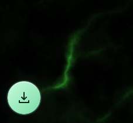
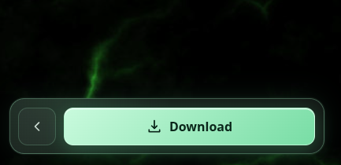
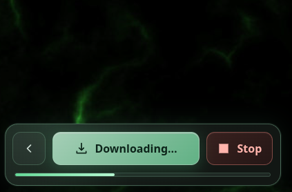
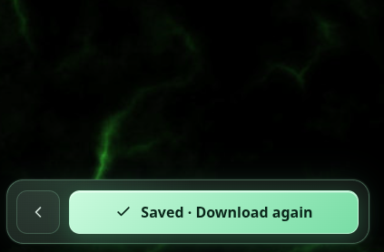
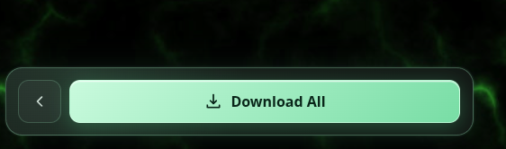
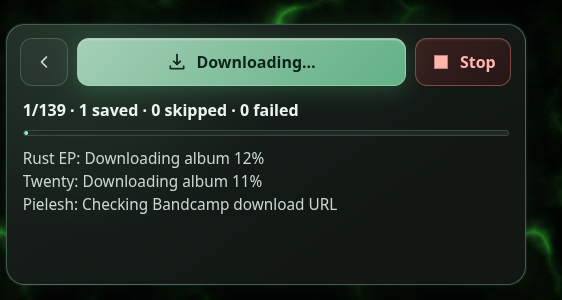
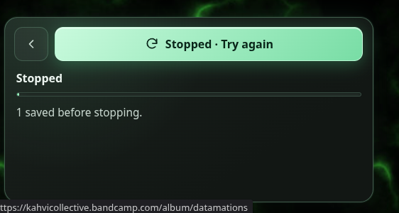

# Scripts

## Bandcamp Collection Downloader

A userscript for saving free or purchased Bandcamp releases in lossless FLAC format.

The script adds **Download All** to artist root and `/music` pages, and **Download** to individual album and track pages. It supports:

- direct free downloads;
- downloads previously authorized by email for the artist or label;
- email-gated free/name-your-price downloads, using a temporary Guerrilla Mail inbox;
- releases in the logged-in Bandcamp user's collection.

Albums use Bandcamp's zipped FLAC download. Standalone tracks are saved as a ZIP containing the FLAC and cover artwork. Discography downloads run with at most three active releases, and a compact floating panel shows progress and can stop the active queue. Paid releases outside the user's collection are skipped.

### Screenshots

| Floating panel                                                                      | Release download                                                                 |
| ----------------------------------------------------------------------------------- | -------------------------------------------------------------------------------- |
|  |  |

| Download in progress                                                             | Download finished                                                          |
| -------------------------------------------------------------------------------- | -------------------------------------------------------------------------- |
|  |  |

| Collection download                                                                    | Collection in progress                                                                         | Collection stopped                                                                           |
| -------------------------------------------------------------------------------------- | ---------------------------------------------------------------------------------------------- | -------------------------------------------------------------------------------------------- |
|  |  |  |

---

# Development

Install dependencies:

```sh
pnpm install
```

Build the userscript:

```sh
pnpm run build
```

Watch and rebuild while developing:

```sh
pnpm start
```

The built userscript is written to:

```text
dist/collection_downloader.user.js
```

## Checks

```sh
pnpm run type-check
pnpm run format:check
```
